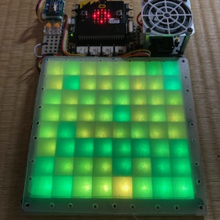

# micro:bitサーモグラフ

（注意）
本リポジトリは2024年8月に作成したが、ハードウェア自体は2019年ごろ作成しており、利用パーツの多くは代替わりしている。

## 利用パーツ

-  [micro;bit](https://microbit.org/ja/)
    - v1.3Bを使用
    - 現行品は「[micro:bit（マイクロビット） v2.2](https://www.switch-science.com/products/7952)」
- [Grove Shield for micro:bit](https://www.switch-science.com/products/3497/)
    - 販売終了済
    - 現行品は「[micro:bit用GROVEシールド v2.0](https://www.switch-science.com/products/5434?)」
- [Conta™ サーモグラフィー AMG8833搭載](https://www.switch-science.com/products/3395)
    - 「[GROVE - プロトシールド](https://www.switch-science.com/products/799)」に上記センサを載せてGroveケーブルで接続したが、現在はGrove端子のある「[スイッチサイエンス AMG8833搭載赤外線アレイセンサモジュール](https://www.switch-science.com/products/9340)」が販売されている。
- NeoPixel対応 LEDテープ
    - 1m 60個のものを使用
    - 8x8の配置は「Z」上でなく、「己」状？とした。行間の配線を短くするため。\
    └０-１-２-３-４-５-６-７┐\
    ┌15-14-13-12-11-10-９-８┘\
    └16-17-18-19-20-…(省)
    - Aボタンで左右反転表示できるようにした。AMG8833とLEDを（１）同じ向きに配置、（２）逆向きに配置、のどちらにも対応できる。
- [音声合成LSI ATP3011F4-PU(かわいい女性の音声)](https://akizukidenshi.com/catalog/g/g105665/)
    - microbitとはシリアル接続。シリアルにローマ字でテキスト出力すると、読み上げてくれる。
    - 利用しない場合、シリアル関連ブロックを削除する。
    - 単体ではスピーカーを鳴らせないため、ATP3012データシートの付録を参考に「[TPA2006使用 超小型D級アンプキット](https://akizukidenshi.com/catalog/g/g108161/)」でスピーカを鳴らす「[AquesTalk Pico アンプ基板](https://github.com/ohguma/aquestalk_pico_amp)」を自作した。
    - [ATP3011F4 データシート](https://akizukidenshi.com/goodsaffix/atp3011f4_datasheet.pdf)
    - [ATP3012 データシート](https://akizukidenshi.com/goodsaffix/atp3012_datasheet.pdf)
- [GROVE - 超音波距離センサモジュール](https://www.switch-science.com/products/1383)
    - ボタン操作を非接触にするために利用。

## その他ハードウェア関連
- [タミヤ ユニバーサルプレートL（210×160mm）](https://www.tamiya.com/japan/products/70172/index.html)に各部品を実装。
- 下記を3Dプリンタで召喚した。
    - [theamo.stl](cad/theamo.stl)　LEDテープの上に乗せる枠。枠内で光を拡散させる。
    - [grove_wrap_a.stl](cad/grove_wrap_a.stl)　AMG8833を載せたGroveプロトシールド用ケースのトップ側
    - [grove_wrap_b.stl](cad/grove_wrap_b.stl)　AMG8833を載せたGroveプロトシールド用ケースのボトム側
    - [grove_us.stl](cad/grove_us.stl)　超音波センサ用の取り付け台

- LEDテープに載せた枠と光の拡散について。
    - 　枠だけ。LEDが直接見えると眩しい。 
    - 　枠にダイソーのPP版を載せた場合。
    - 　枠にトレーシングペーパーを載せた場合。
    - 　枠にPP板とトレーシングペーパーの載せた場合。
    - 　超音波センサ台。はめ込み式。

- 動作状況
    - <video src="document/IMG_5837.MOV" controls="true" height="600"></video>

## 2019年の作成当時の記事など
- 2019-12-31 Qiita 
 [micro:bitでサーモグラフィーを作ってみた](https://qiita.com/ohguma/items/40993b96a3e80dcb14a0)
    - 「[micro:bit Advent Calendar 2019](https://qiita.com/advent-calendar/2019/microbit)」に参加　12/25
- 2019-07-07 [micro:bitでサーモグラフィーを作ってみた（さらに更新）](https://ohguma.hatenablog.com/entry/2019/07/07/080131)
- 2019-06-30 [micro:bitでサーモグラフィーを作ってみた（更新）](hhttps://ohguma.hatenablog.com/entry/2019/06/30/215628)
- 2019-03-31 [micro:bitでサーモグラフィーを作ってみた。](https://ohguma.hatenablog.com/entry/2019/03/31/104407)

----

- 2024-08-02 超音波センサ追加
- 2019-06-27 初版

## 以下はMakeCodeでgithub拡張機能設定時の内容

> このページを開く [https://ohguma.github.io/microbit_thermograph/](https://ohguma.github.io/microbit_thermograph/)

### 拡張機能として使用

このリポジトリは、MakeCode で **拡張機能** として追加できます。

* [https://makecode.microbit.org/](https://makecode.microbit.org/) を開く
* **新しいプロジェクト** をクリックしてください
* ギアボタンメニューの中にある **拡張機能** をクリックしてください
* **https://github.com/ohguma/microbit_thermograph** を検索してインポートします。

### このプロジェクトを編集します

MakeCode でこのリポジトリを編集します。

* [https://makecode.microbit.org/](https://makecode.microbit.org/) を開く
* **読み込む** をクリックし、 **URLから読み込む...** をクリックしてください
* **https://github.com/ohguma/microbit_thermograph** を貼り付けてインポートをクリックしてください

#### メタデータ (検索、レンダリングに使用)

* for PXT/microbit

----